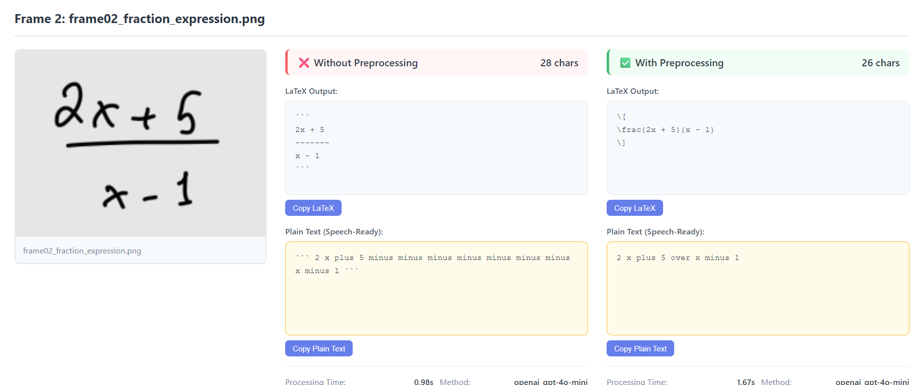
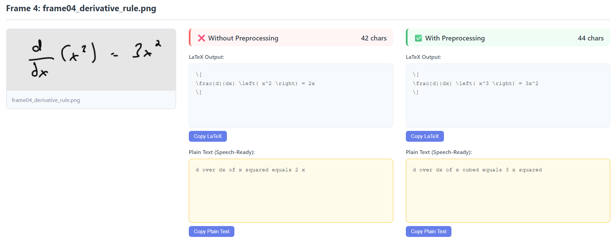

These two pictures show that the OCR pipeline is working correctly:
1- preprocessing is important (showed a comparison between with and without preprocessing).
2- Openai OCR is working, producing a latex output.
3- postprocessing for the latex output so it becomes a text ready to be converted to speech.

